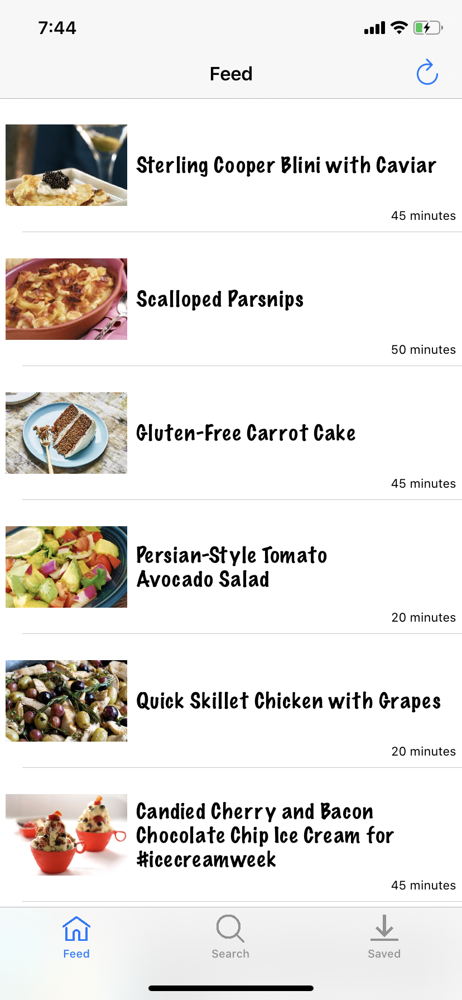
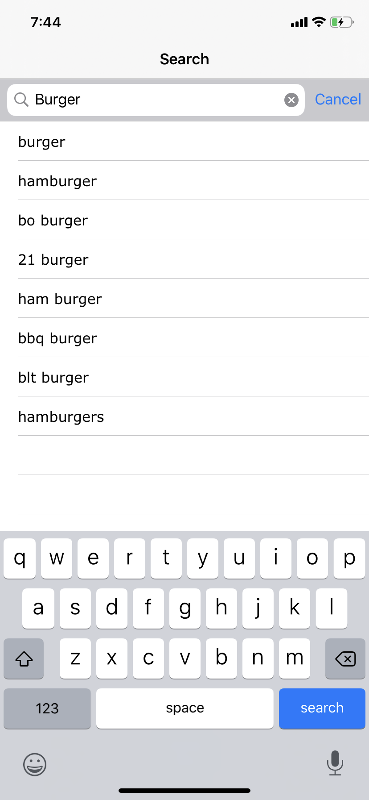
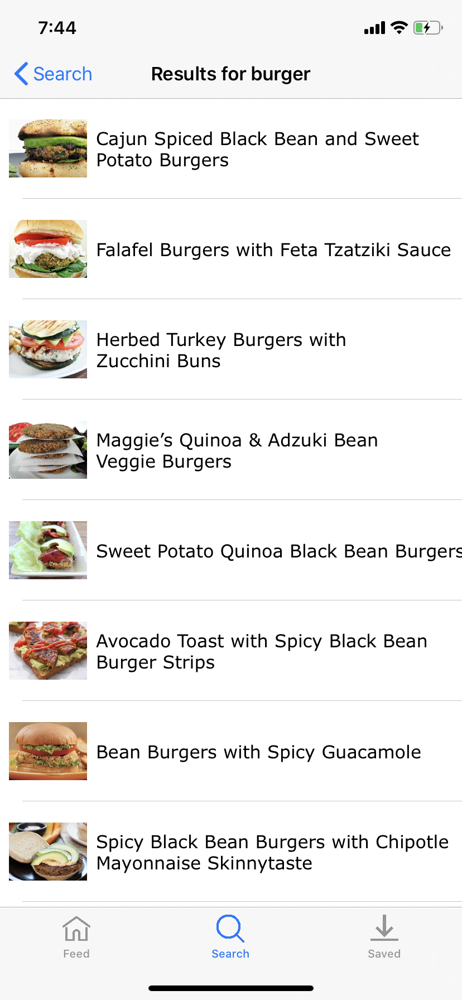
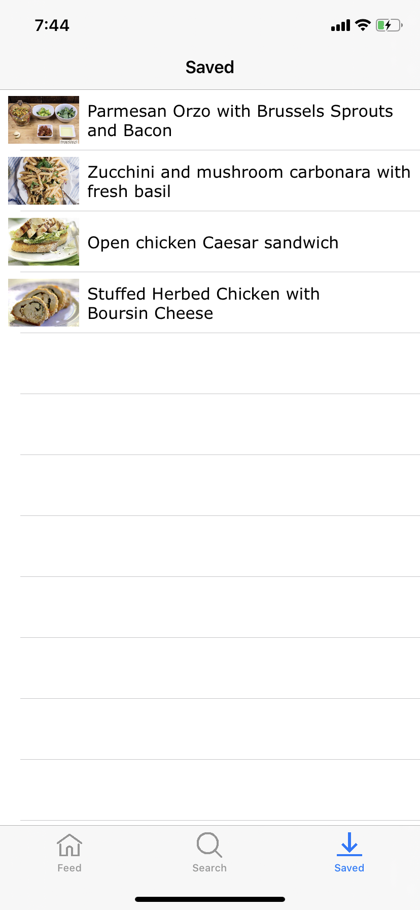
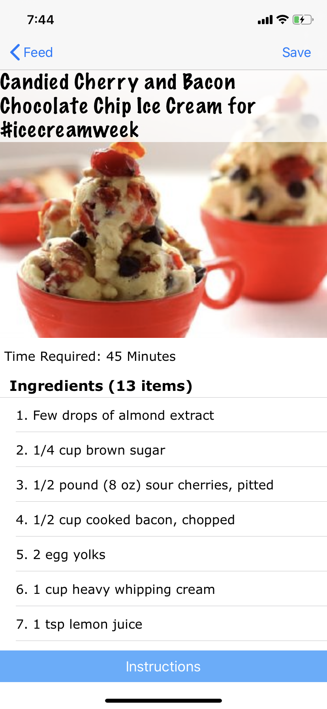
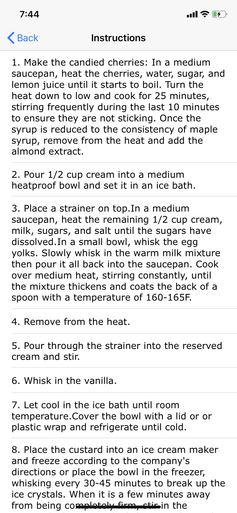

# Food and Recipe

Food and Recipe is an app that lets a user to search recipes through spoonacular API and enable users to save favourite recipes in their app offline.

## App Features

1. Search recipes online through spoonacular API.
2. Save user's favourite recipes offline.

## Screenshots 
  &nbsp; &nbsp;  &nbsp; &nbsp;  &nbsp; &nbsp;  &nbsp; &nbsp;  &nbsp; &nbsp; 

## How to build/compile
1. Open "Food and Recipe.xcodeproj" file.
2. Select appropriate simulator.
3. Click the run button or command + R to run the project.

## Requirements
1. Xcode 10.3
2. Swift 5

## APIs used
1. https://spoonacular.com/food-api/docs

## License
This code is free and open source.
